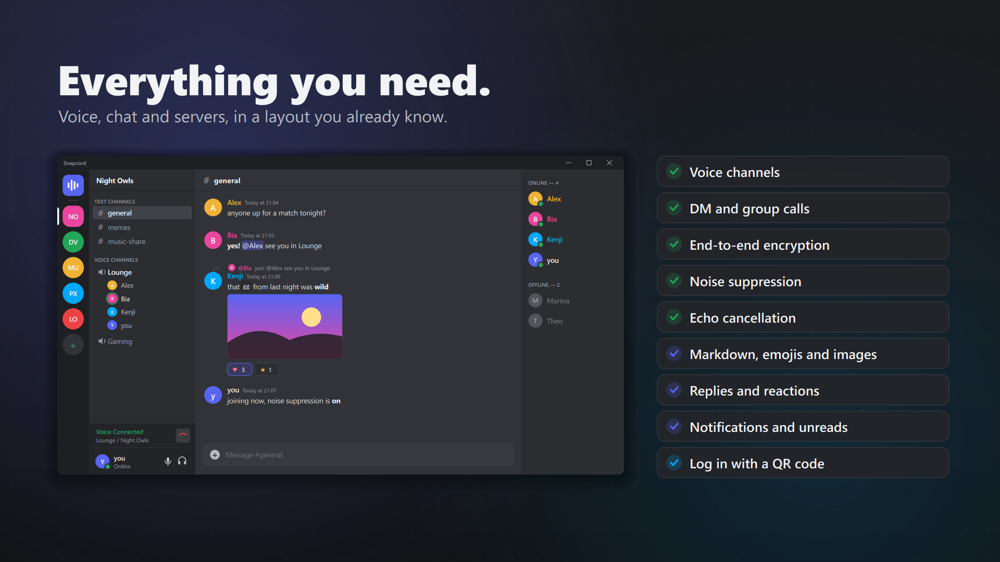
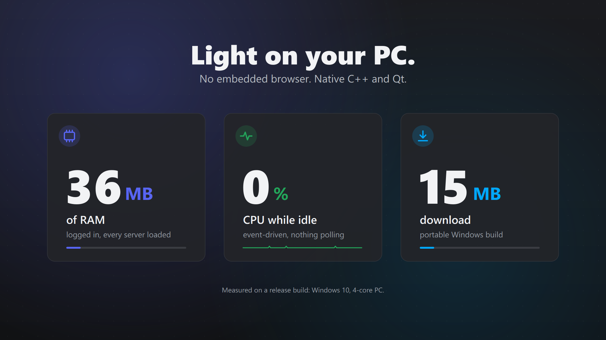

# Snapcord

A **native, lightweight, open-source** Discord client focused on **voice calls**.
Built with C++ and Qt 6, with no embedded browser, so it uses little memory and almost no CPU while idle.



<p align="center">
  
  
</p>

<sub>Images from the promo video. The names in the interface are made up.</sub>

## ⚠️ Disclaimer

Snapcord is **not affiliated with Discord**. Using third-party clients violates the
[Discord Terms of Service](https://discord.com/terms) and **may get your account banned**.
Use at your own risk.

## Features

- **Voice:** voice channels and calls in direct messages and groups, with Discord's end-to-end encryption
  (DAVE), noise suppression, echo cancellation, automatic gain control, push to talk (Windows) and
  per-user volume
- **Chat:** text channels and direct messages with Discord's markdown, emojis, images, embeds, replies,
  reactions, editing and unread indicators
- **Notifications** for direct messages and mentions
- Login with a **QR code** (Discord mobile app) or a token
- Layout faithful to the official client, in **English** and **Brazilian Portuguese**

## Download

Get the latest version from the [Releases page](https://github.com/pedrordgsr/snapcord/releases).

| System | File | Notes |
|---|---|---|
| Windows 10/11 | `Snapcord-…-windows-x64-setup.exe` | Installer. Or use the portable `…-windows-x64.zip`. |
| macOS 12+ (Apple Silicon) | `Snapcord-…-macos-arm64.dmg` | Drag Snapcord to Applications. |
| Linux | `Snapcord-…-linux-x86_64.AppImage` | Make it executable and run it. |
| Linux | `Snapcord-…-linux-x86_64.flatpak` | `flatpak install --user Snapcord-…flatpak` |

The builds are not signed with paid certificates yet, so the system may warn you the first time:

- **Windows:** "Windows protected your PC" → click **More info** → **Run anyway**.
- **macOS:** right-click Snapcord in Applications → **Open** → **Open**. If macOS says the app is damaged,
  run `xattr -dr com.apple.quarantine /Applications/Snapcord.app` in Terminal.
- **Linux (AppImage):** `chmod +x Snapcord-*.AppImage`, then run it. The login is stored in your keyring
  (GNOME Keyring, KDE Wallet…).

## Building

Requirements on every platform: CMake 3.28+, Ninja, a C++20 compiler, Qt 6.8 (with the WebSockets and
Image Formats modules) and [vcpkg](https://github.com/microsoft/vcpkg). The other dependencies are built
by vcpkg from `vcpkg.json`.

```sh
export QT_ROOT_DIR=/path/to/Qt/6.8.3/<platform>
export VCPKG_ROOT=/path/to/vcpkg
cmake --preset release
cmake --build --preset release
```

- **Windows:** Visual Studio 2022 Build Tools. `.\scripts\build.ps1 -Run` sets up the environment and builds.
- **Linux:** also `autoconf autoconf-archive automake libtool pkg-config libsecret-1-dev`.
- **macOS:** also `brew install autoconf autoconf-archive automake libtool`.

Packages are built by `packaging/<system>/package.*` and, for Flatpak, from
`packaging/flatpak/io.github.pedrordgsr.Snapcord.yml`. Pushing a `v*` tag makes GitHub Actions build every
package and prepare a draft release.

## Translations

English is the source language. Translations live in [`translations/`](translations) as Qt Linguist `.ts`
files. To refresh them after changing interface text, build the `Snapcord_lupdate` target and edit the
files with Qt Linguist.

## License

[GPLv3](LICENSE): anyone can use, study, modify and redistribute Snapcord, as long as modified versions
are also released under the GPLv3.
